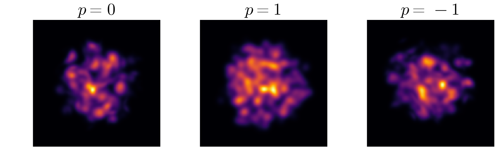

# MonteCarloGlauber

[](https://github.com/AndreasKirchner/MonteCarloGlauber.jl/actions/workflows/CI.yml?query=branch%3Amain)
[](https://andreaskirchner.github.io/MonteCarloGlauber.jl/dev/)

The MonteCarloGlauber.jl package simulates initial conditions for heavy-ion collisions based on the Glauber model.

## Documentation
The full documentation lives in `docs/` and is built with Documenter.jl.

Build the docs locally:
```bash
julia --project=docs -e 'using Pkg; Pkg.develop(path="."); Pkg.instantiate()'
julia --project=docs docs/make.jl
```
The generated site is in `docs/build/`.

## Installation
To install the package and its dependencies, run:
```julia
import Pkg
Pkg.add(url = "https://github.com/AndreasKirchner/MonteCarloGlauber.jl")
```
Then load the package with:
```julia
using MonteCarloGlauber
```

## Quickstart
```julia
using MonteCarloGlauber

# Create lead nuclei
n1 = Lead()
n2 = Lead()

# Collision parameters
w = 0.5          # nucleon width
s_NN = 2760      # Center-of-mass energy (GeV)
k = 1            # fluctuation parameter
p = 0.0          # reduced thickness parameter
```
This defines the two nuclei and the collision parameters. 

To sample events, create the `Participants` distribution:
```julia
Nev = 10
participants = Participants(n1, n2, w, s_NN, k, p)
evt = rand(participants, Nev)
```

We can look at the events by evaluating them on a grid (requires Plots.jl):
```julia
using Plots

profile = map(evt) do x
    map(Iterators.product(-10:0.5:10, -10:0.5:10)) do y
        x(y...)
    end
end
heatmap(-10:0.5:10, -10:0.5:10, profile[1])
```
<p align="center">
  
</p>
